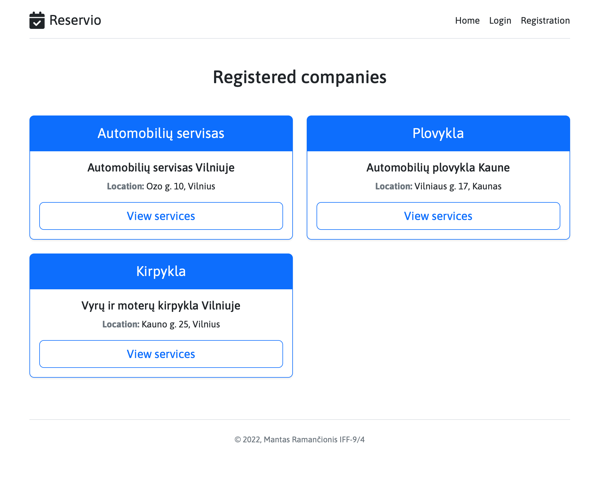
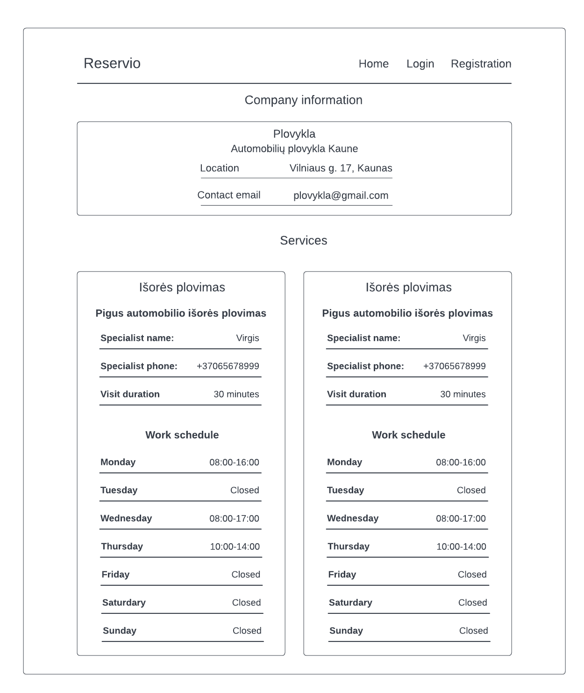
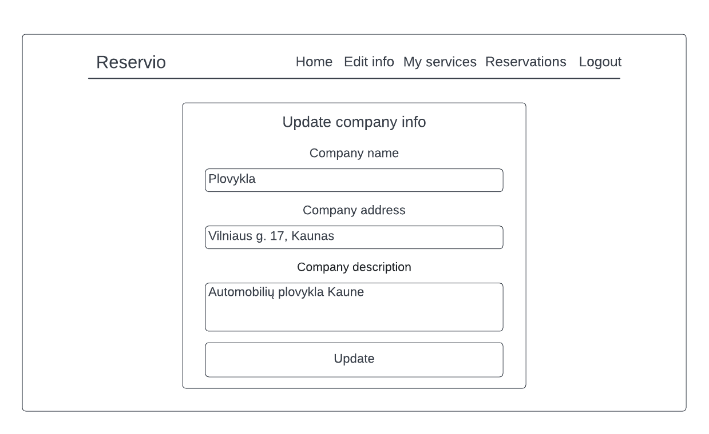
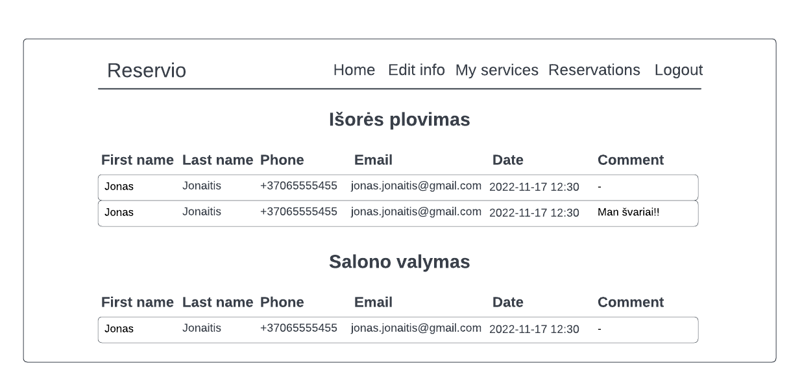

### 1. Sprendžiamo uždavinio aprašymas

**1.1. Sistemos paskirtis**

Projekto tikslas – sukurti informacinę sistemą, leidžiančią smulkioms įmonėms ar verslams (kirpykloms, odontologijos kabinetams, grožio salonams ir t.t.), kurių biudžetas neleidžia turėti nuosavos IS, registruoti būsimus vizitus, o jų klientams – rezervuoti pasirinktą vizito laiką.

Šią informacinę sistemą sudarys dvi esminės dalys – aplikacijų programavimo sąsaja (angl. API) bei grafinė naudotojo sąsaja, realizuota kaip WEB aplikacija.

Įmonė ar verslas, norėdamas pradėti naudotis informacine sistema ir suteikti galimybę savo klientams rezervuoti vizito laikus, iš pradžių turės užsiregistruoti – nurodyti veiklos pavadinimą, rūšį, kontaktus. Atlikusi šiuos veiksmus įmonė turės sulaukti administratoriaus patvirtinimo. Gavusi patvirtinimą įmonė galės pridėti savo teikiamas paslaugas (paslaugos iš esmės galėtų būti ir tokios pačios, tiesiog skirtųsi tas paslaugas suteikiantys specialistai) – kiekvienai jų reikės nurodyti aprašymą, tą paslaugą suteikiančio specialisto darbo laiką, specialisto kontaktus. Klientas, norėdamas atlikti laiko rezervaciją tam tikroje įmonėje, tam tikrai paslaugai, turės taip pat užsiregistruoti nurodydamas savo asmeninius duomenis – vardą, pavardę, el. paštą, telefono numerį. Atlikęs pasirinkto laiko rezervaciją klientas turės sulaukti patvirtinimo iš įmonės, o vėliau, esant poreikiui, tiek klientas, tiek įmonė rezervaciją galės atšaukti.

**1.2. Funkciniai reikalavimai**

Neregistruotas sistemos naudotojas (svečias) galės:
1. Peržiūrėti įmonių sąrašą
2. Peržiūrėti informaciją apie konkrečią įmonę
3. Peržiūrėti konkrečios įmonės teikiamas paslaugas
4. Peržiūrėti konkrečios įmonės ir konkrečios paslaugos sukurtas rezervacijas (laisvus vizitų laikus)
5. Užsiregistruoti kaip klientas
6. Užsiregistruoti kaip paslaugas teikianti įmonė

Registruotas sistemos naudotojas (įmonė) galės:
1. Prisijungti
2. Atsijungti
3. Pridėti teikiamą paslaugą
4. Peržiūrėti paslaugos informaciją
5. Atnaujinti paslaugos informaciją
6. Ištrinti teikiamą paslaugą
7. Peržiūrėti savo įmonės teikiamų paslaugų sąrašą
8. Peržiūrėti informaciją apie konkrečią rezervaciją
9. Peržiūrėti konkrečios paslaugos rezervacijų sąrašą
10. Atnaujinti įmonės informaciją

Registruotas sistemos naudotojas (klientas) galės:
1. Prisijungti
2. Atsijungti
3. Peržiūrėti įmonių sąrašą
4. Peržiūrėti informaciją apie konkrečią įmonę
5. Peržiūrėti konkrečios įmonės teikiamas paslaugas
6. Peržiūrėti konkrečios įmonės ir konkrečios paslaugos sukurtas rezervacijas (laisvus vizitų laikus)
7. Sukurti rezervaciją
8. Atšaukti (ištrinti) konkrečią rezervaciją
9. Atnaujinti rezervacijos duomenis
10. Peržiūrėti savo visų rezervacijų sąrašą

Registruotas sistemos naudotojas (administratorius) galės:
1. Prisijungti
2. Atsijungti
3. Peržiūrėti įmonių sąrašą
4. Peržiūrėti informaciją apie konkrečią įmonę
5. Peržiūrėti konkrečios įmonės teikiamas paslaugas
6. Peržiūrėti konkrečios įmonės ir konkrečios paslaugos sukurtas rezervacijas (laisvus vizitų laikus)
7. Patvirtinti įmonės registraciją
8. Pašalinti įmonę

### 2. Sistemos architektūra

**2.1. Pasirinktos technologijos**

Sistemą sudarys dvi dalys:
* Serverio pusė (aplikacijų programavimo sąsaja) – ji bus realizuota su Go programavimo kalba. Duomenų bazės valdymo sistema buvo pasirinkta PostgreSQL.
* Kliento pusė – ji bus realizuota su JavaScript biblioteka React.

**2.2. Diegimo diagrama**

2.1 pav. pavaizduota sistemos diegimo diagrama. Sistemos talpinimui bus panaudotas Amazon Web Services serveris, kuriame sistemos naudotojų užklausas HTTP protokolu apdoros Traefik atvirkštinis tarpinis serveris (angl. reverse proxy) – jis HTTP užklausas persiųs arba į aplikacijų programavimo sąsają (serverio dalį), arba į WEB aplikaciją (kliento dalį), tuomet sulauks atsakymo ir jį persiųs atgal sistemos naudotojui. Sistemos realizacijai prireiks duomenų bazės valdymo serverio, o komunikaciją su juo atliks aplikacijų programavimo sąsaja TCP/IP protokolu.

**pav. 2.1 Sistemos diegimo diagrama**

### 3. Naudotojo sąsajos projektas

Žemiau pateikiami projektuojamos sąsajos langų wireframe`ai ir juos atitinkančių realizacijų langų iškarpos.

**3.1. Pradinis langas**

Wireframe:

Realizacijos langas:

**3.2. Informacijos apie įmonę langas**

Wireframe:

Realizacijos langas:

**3.3. Prisijungimo langas**

Wireframe:

Realizacijos langas:

**3.4. Kliento registracijos langas**

Wireframe:

Realizacijos langas:

**3.5. Įmonės registracijos langas**

Wireframe:

Realizacijos langas:

**3.6. Naujos rezervacijos sukūrimo langas**

Wireframe:

Realizacijos langas:

**3.7. Kliento rezervacijų sąrašo langas**

Wireframe:

Realizacijos langas:

**3.8. Kliento rezervacijos peržiūros langas**

Wireframe:

Realizacijos langas:

**3.9. Kliento rezervacijos atnaujinimo langas**

Wireframe:

Realizacijos langas:

**3.10. Administratoriaus pradinis langas**

Wireframe:

Realizacijos langas:

**3.11. Įmonės informacijos atnaujinimo langas**

Wireframe:

Realizacijos langas:

**3.12. Įmonės teikiamų paslaugų sąrašo langas**

Wireframe:

Realizacijos langas:

**3.13. Įmonės paslaugos atnaujinimo langas**

Wireframe:

Realizacijos langas:

**3.14. Įmonės naujos paslaugos sukūrimo langas**

Wireframe:

Realizacijos langas:

**3.15. Įmonės paslaugų rezervacijų sąrašo langas**

Wireframe:

Realizacijos langas:

